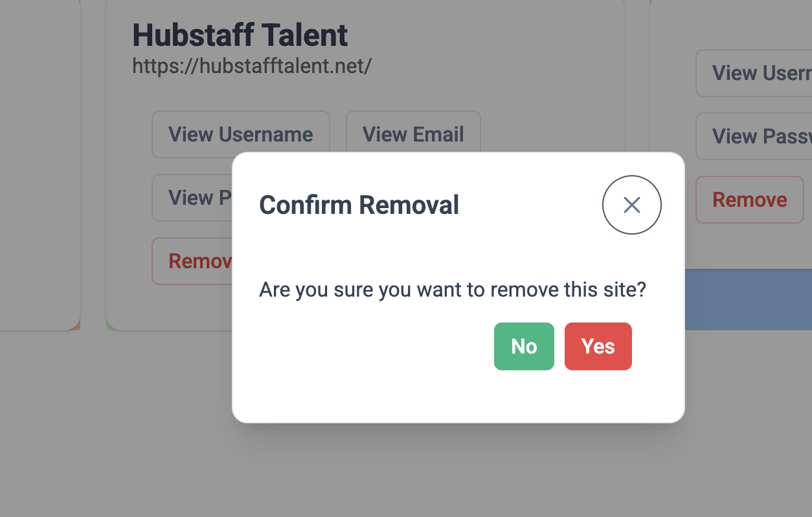

# BabePass

A tool to manage the website passwords locally.

## To use download this project and run using angular command
```bash
ng serve
```

Once the server is running, open your browser and navigate to `http://localhost:4200/`. The application will automatically reload whenever you modify any of the source files.


### Add new site:


### View site details:


### Update site details:


### Remove site details:


## Happy Coding
### A R
